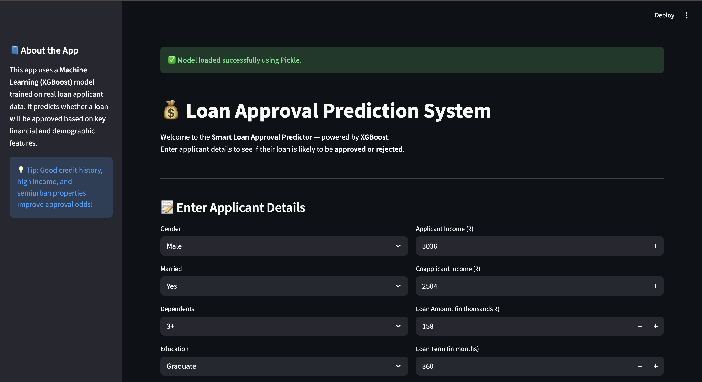
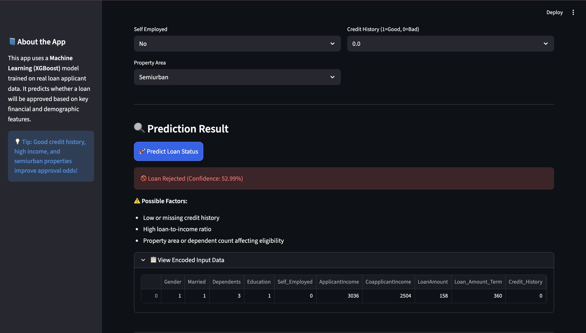
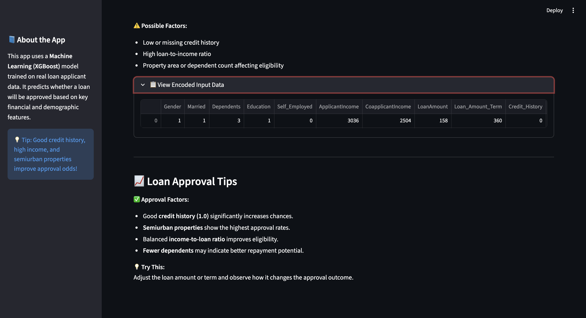

# 🏦 Loan Approval Prediction System using XGBoost
### **Objective** : Predict whether a loan application will be approved or not based on applicant and loan details.
### **Type** : Classification problem (binary: Approved / Not Approved).

## 📘 Project Overview
The **Loan Approval Prediction System** is a **machine learning-powered web application** designed to assist financial institutions in evaluating loan eligibility efficiently.  
By analyzing key applicant attributes such as **income, dependents, education, property area, and credit history**, the system predicts whether a loan application is **approved or rejected**.

The project combines **data preprocessing**, **feature engineering**, **model comparison**, and **XGBoost optimization**, along with a fully interactive **Streamlit dashboard** that allows users to test real scenarios.

---

| Column                      | Type                          | Meaning                                                        | Example Interpretation                         |
| :-------------------------- | :---------------------------- | :------------------------------------------------------------- | :--------------------------------------------- |
| **Gender**                  | Categorical (encoded)         | Applicant’s gender (0 = Female, 1 = Male)                      | `1` → Male applicant                           |
| **Married**                 | Categorical (encoded)         | Whether applicant is married (0 = No, 1 = Yes)                 | `0` → Not married                              |
| **Dependents**              | Numerical                     | Number of dependents supported by the applicant                | `0` → No dependents, `1` → one dependent, etc. |
| **Education**               | Categorical (encoded)         | Educational level (0 = Not Graduate, 1 = Graduate)             | `1` → Graduate                                 |
| **Self_Employed**           | Categorical (encoded)         | Self-employment status (0 = No, 1 = Yes)                       | `0` → Salaried person                          |
| **ApplicantIncome**         | Numerical                     | Applicant’s monthly income                                     | `5849` → ₹ 5849 per month                      |
| **CoapplicantIncome**       | Numerical                     | Monthly income of co-applicant (spouse or partner)             | `0` → No co-applicant income                   |
| **LoanAmount**              | Numerical                     | Loan amount (in thousands)                                     | `128` → ₹ 128 000 loan                         |
| **Loan_Amount_Term**        | Numerical                     | Duration of loan repayment in months                           | `360` → 30-year loan                           |
| **Credit_History**          | Categorical (encoded numeric) | Past repayment record (0 = Bad / no history, 1 = Good history) | `1` → Good repayment record                    |
| **Property_Area_Rural**     | Dummy variable                | 1 if applicant’s property is in a rural area                   | `0` → Not rural                                |
| **Property_Area_Semiurban** | Dummy variable                | 1 if property is in a semi-urban area                          | `0` → Not semi-urban                           |
| **Property_Area_Urban**     | Dummy variable                | 1 if property is in an urban area                              | `1` → Urban                                    |
| **Loan_Status**             | **Target variable**           | Whether loan was approved (0 = Rejected, 1 = Approved)         | `1` → Approved                                 |

---

### Accuracy in the algorithms used:
| Algorithms                     | Accuracy | 
| :------------------------- | :---------------: | 
| **Decision Tree**               |       85%      | 
| **Random Forest**    |        85.37%       | 
| **XGBoost**       |        86.18%      | 

---

---

Conclusion

This project demonstrates how machine learning can automate loan approval decisions effectively.
By analyzing applicant information and financial parameters, the model provides accurate, explainable, and fair predictions that can support banks and NBFCs in real-time decision-making.

The Streamlit-based dashboard adds practical usability and user interaction, making it a complete end-to-end AI solution for loan prediction.

